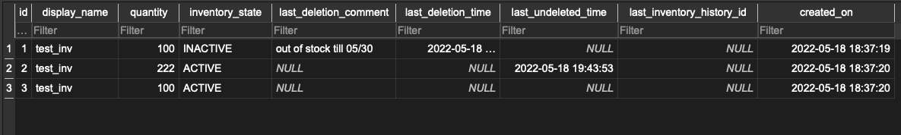

# Application Functionality

The application supports following functionality:
- CRUD operations for inventory items
- Requirement 1 from the challenge - When deleting, allow deletion comments and undeletion

## Features
- Built using Flask
- Uses SQLAlchemy as ORM
- Uses SQLite for database
- Code structured into MVC (model, views, controllers)

## DB Features
- Enum based inventory state (ACTIVE, INACTIVE)
- Keeps a track of last_deletion_comment, last_deletion_time

## Features
- Built using Flask as webserver
- Uses SQLAlchemy as ORM
- Uses SQLite for database
- Code structured into MVC (model, views, controllers)

# Steps to run

### Run locally

    python main.py

### Run on Replit

    Click Run on Replit UI (uses .replit file)

### Demo hosted at
    https://test-sic.sumedhk.repl.co/

No other configuration required.

# API Documentation

Following is the Rest API documentation for the app functionality

## Get list of inventory
Retrieves a list of ACTIVE inventory items

### Request

`GET /inventory/all`

    curl --request GET --url http://localhost:5000/inventory/all --header 'Content-Type: application/json'

### Response

    HTTP/1.1 200 OK
    content-type: application/json
    date: Wed, 18 May 2022 18:39:13 GMT
    content-length: 1018

    [{
        "created_on":"2022-05-18 18:39:06",
        "display_name":"test_inv",
        "id":"1",
        "inventory_state":"InventoryState.ACTIVE",
        "last_deletion_comment":"None",
        "last_deletion_time":"None",
        "last_inventory_history_id":"None",
        "last_undeleted_time":"None",
        "quantity":"100"
     }]

## Get list of INACTIVE inventory
Retrieves a list of INACTIVE inventory items

### Request

`GET /inventory/all?inventory_state=INACTIVE`

    curl --request GET --url 'http://localhost:5000/inventory/all?inventory_state=INACTIVE' --header 'Content-Type: application/json'

### Response

    HTTP/1.1 200 OK
    content-type: application/json
    date: Wed, 18 May 2022 18:39:13 GMT
    content-length: 1018

    [{
        "created_on": "2022-05-18 18:23:39",
        "display_name": "test_inv2",
        "id": "1",
        "inventory_state":"InventoryState.INACTIVE",
        "last_deletion_comment": "out of stock till 05/30",
        "last_deletion_time": "2022-05-18 18:24:07",
        "last_inventory_history_id": "None",
        "last_undeleted_time": "None",
        "quantity": "111"
    }]

## Create a new inventory item
Creates a new inventory items by providing inventory item characteristics. See example below

### Request

`POST /inventory/create`

    curl --request POST --url http://localhost:5000/inventory/create --header 'Content-Type: application/json' --data '{"display_name" : "test_inv", "quantity" : 100}'

### Response

    HTTP/1.1 201 Created
    content-type: application/json
    date: Wed, 18 May 2022 18:39:13 GMT
    content-length: 9

    {"inventory_id":4}

## Get a specific Inventory item
Get inventory item by id

### Request

`GET /inventory/:id`

    curl --request GET --url http://localhost/inventory/1 --header 'Content-Type: application/json'

### Response
    HTTP/1.1 200 OK
    Date: Wed, 18 May 2022 18:24:11 GMT
    Content-Type: application/json
    Content-Length: 336
    Connection: close

    {
        "created_on": "2022-05-18 18:23:39",
        "display_name": "test_inv2",
        "id": "1",
        "inventory_state":"InventoryState.ACTIVE",
        "last_deletion_comment": "out of stock till 05/30",
        "last_deletion_time": "2022-05-18 18:24:07",
        "last_inventory_history_id": "None",
        "last_undeleted_time": "None",
        "quantity": "111"
    }

## Update inventory item
Change few properties of inventory items e.g. quantity, display_name

### Request

`PUT /inventory/:id`

    curl --request POST --url http://localhost:5000/inventory/1/update --header 'Content-Type: application/json' --data '{"display_name" : "test_inv2", "quantity" : 111}'

### Response

    HTTP/1.1 202 Accepted
    Date: Wed, 18 May 2022 18:24:11 GMT
    Content-Type: application/json
    Content-Length: 24
    Connection: close

    {"inventory_id":1}

## Delete inventory item
- Deleting inventory item is soft delete and doesn't remove it from Inventory table
- Marks inventory item as INACTIVE
- Optional deletion comments could be provided

### Request

`DELETE /inventory/:id`

    curl --request DELETE --url http://localhost:5000/inventory/1/delete --header 'Content-Type: application/json' --data '{"last_deletion_comment" : "out of stock till 05/30"}'

### Response

    HTTP/1.1 202 Accepted
    Date: Wed, 18 May 2022 18:24:11 GMT
    Content-Type: application/json
    Content-Length: 24
    Connection: close

    {"inventory_id":1}

## Undelete inventory item
- Undelete marks inventory item as ACTIVE
- Optional parameters like quantity, display_name can be updated

### Request

`POST /inventory/:id/undelete`

    curl --request POST --url http://localhost:5000/inventory/1/undelete --header 'Content-Type: application/json' --data '{"quantity" : 222
}'

### Response

    HTTP/1.1 202 Accepted
    Date: Wed, 18 May 2022 18:24:11 GMT
    Content-Type: application/json
    Content-Length: 24
    Connection: close

    {"inventory_id":1}